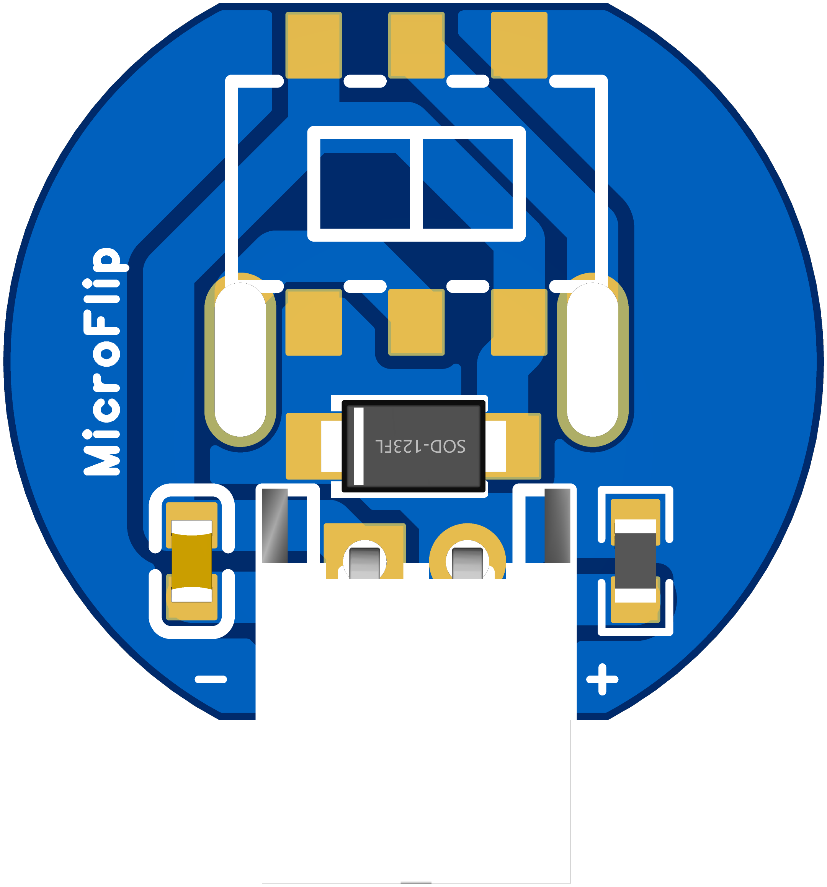

# MicroFlip

*Ultra‑compact polarity‑reverser board for N20‑size brushed DC gear‑motors*

---

## Table of Contents

1. [Overview](#overview)
2. [Features](#features)
3. [Hardware Files](#hardware-files)
4. [Schematic & PCB](#schematic--pcb)
5. [Roadmap](#roadmap)
6. [Contributing](#contributing)
7. [License](#license)
   
---

## Overview

**MicroFlip** is a thumb‑sized breakout that lets you drive a 3–12 V N20 gear‑motor in either direction with a single slide. A rugged DPDT switch wired in an H‑pattern swaps both motor leads, while an on‑board 0 .1 µF / 120 Ω RC snubber suppresses brush noise and protects the contacts from arcing.

Drop MicroFlip between your battery and the motor, bolt the board to the chassis with two M2 screws, and enjoy instant bidirectional control—no microcontroller, no firmware, just **flip to drive, flip back to rewind**.

  

---

## Features

* **True DPDT reversal** – slide switch swaps *both* motor leads for reliable forward ↔ reverse operation.
* **Compact footprint (18 × 11 mm)** – fits inside most micro‑robot and lock‑actuator housings.
* **Up to 1 A stall current** – short traces keep resistive losses low.
* **Integrated RC snubber** – 0 .1 µF X7R + 120 Ω ½ W series network mounted right at the motor pins.
* **Flexible I/O** – large, castellated pads accept 22–26 AWG silicone leads or 2‑pin JST‑PH connectors.

---

## Hardware Files

| Folder        | Contents                                                          |
| ------------- | ----------------------------------------------------------------- |
| `hardware/`   | EasyEDA schematic (`.json`), PCB layout (`.json`), and Gerber ZIP |
| `docs/`       | 3D board renders, schematic PDF, datasheets                       |
| `production/` | Pick‑and‑place CSV, interactive BOM HTML                          |

Gerbers are generated with JLCPCB/EasyEDA defaults (2‑layer, 1 oz copper, HASL‑RoHS). If you send these to another fab check drill tolerances on the 2 mm mounting holes.

---

## Schematic & PCB

---

> **Maximum ratings**: 12 V nominal, 1 A peak. For higher currents use a MOSFET H‑bridge instead.

---

## Roadmap

* **v0.2** – add footprints for dual 4.7 nF line‑to‑case caps (classic 3‑cap EMI network).
* **v0.3** – optional bidirectional TVS across VCC/GND for harsh automotive spikes.

Feel free to open issues or PRs with suggestions!

---

## Contributing

1. Fork the repo, create a feature branch.
2. Commit EasyEDA/Schematics *and* generated Gerbers.
3. Submit a PR with a clear description of what the change does and why.

Please run `./scripts/check‑erc.sh` before pushing; it runs EasyEDA‑CLI ERC and KiCad DRC on the exported PCB.

---

## License

Released under the **MIT License** – see `LICENSE` for details.
