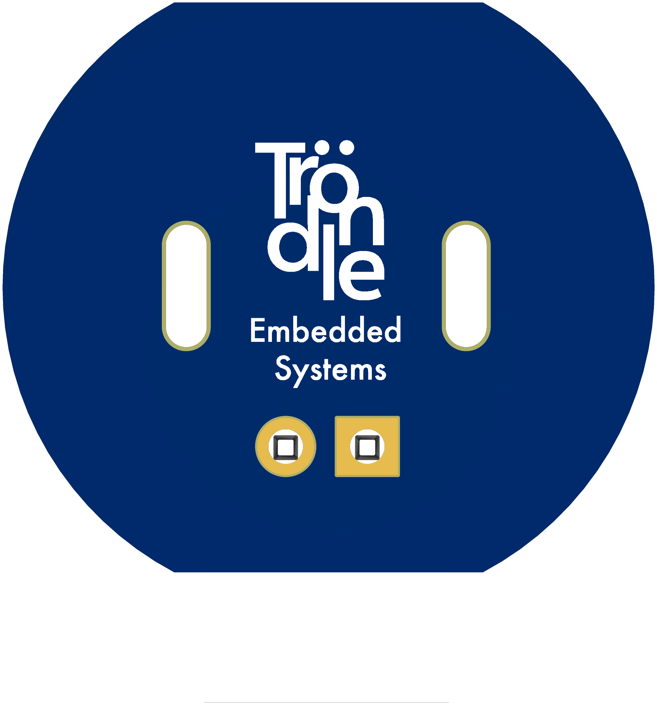

# MicroFlip

*Ultra‑compact polarity‑reverser board for N20‑size brushed DC gear‑motors*

---

## Table of Contents

1. [Overview](#overview)
2. [Features](#features)
3. [Hardware Files](#hardware-files)
4. [Schematic & PCB](#schematic--pcb)
5. [Roadmap](#roadmap)
6. [Contributing](#contributing)
7. [License](#license)
   
---

## Overview

**MicroFlip** is a thumb‑sized breakout that lets you drive a 3–12 V N20 gear‑motor in either direction with a single slide. A rugged DPDT switch wired in an H‑pattern swaps both motor leads, while an on‑board 0 .1 µF / 120 Ω RC snubber suppresses brush noise and protects the contacts from arcing.

Drop MicroFlip between your motor and your motherboard, and enjoy instant bidirectional control—no microcontroller, no firmware, just **flip to drive, flip back to rewind**.

<table>
  <tr>
    <td align="center">
       
      

        <strong>Top view of the MicroFlip PCB</strong>
      

    </td>
    <td align="center">
       
      

        <strong>Bottom view of the MicroFlip PCB</strong>
      

    </td>
  </tr>
</table>

---

## Features

* **True DPDT reversal** – slide switch swaps *both* motor leads for reliable forward ↔ reverse operation.
* **Compact footprint** – fits inside most micro‑robot and lock‑actuator housings.
* **Up to 1 A stall current** – short traces keep resistive losses low.
* **Integrated RC snubber** – 0 .1 µF X7R + 120 Ω ½ W series network mounted right at the motor pins.
* **Flexible I/O** – large, castellated pads accept 22–26 AWG silicone leads or 2‑pin JST‑PH connectors.

  

---

## Hardware Files

| Folder        | Contents                                                          |
| ------------- | ----------------------------------------------------------------- |
| `hardware/`   | EasyEDA schematic (`.json`), PCB layout (`.json`), and Gerber ZIP |
| `docs/`       | 3D board renders, schematic PDF, datasheets                       |
| `production/` | Pick‑and‑place CSV, interactive BOM HTML                          |

Gerbers are generated with JLCPCB/EasyEDA defaults (2‑layer, 1 oz copper, HASL‑RoHS).

---

## Schematic & PCB

> **Maximum ratings**: 12 V nominal, 1 A peak. For higher currents use a MOSFET H‑bridge instead.

---

## Roadmap

TBD

Feel free to open issues or PRs with suggestions!

---

## Contributing

1. Fork the repo, create a feature branch.
2. Submit a PR with a clear description of what the change does and why.

---

## Support

[If you enjoy my work, consider supporting me by buying me a coffee!](https://buymeacoffee.com/Ntrondle)

---

## License

Released under the **GPL-3.0 license** – see `LICENSE` for details.
